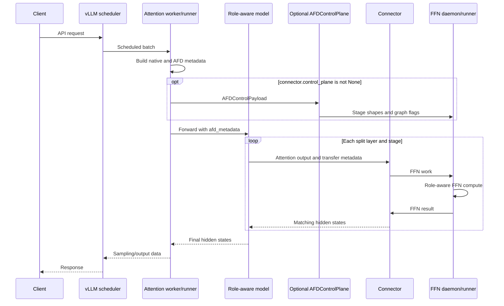

# Attention runtime

## NPU v0.28 review scope

The v0.28 Ascend metadata and dummy-forward copies preserve upstream DCP/GDN,
KVPP and device-metadata state while routing the two AFD ubatches separately.
Final sequence-parallel output gathering belongs to the native model, so the
runner must not gather a second time. CAMP2P fan-in (`A > F`) requires equal
per-Attention token chunks; DP padding is enabled even in eager mode. Unequal
4/2-token real-kernel input reproduced corruption; padding restores 2A1F output.
The exact patch signature and target-contract tests remain the upgrade seam.

## Purpose and boundary

This document is the primary design for Attention-side request and lifecycle
orchestration. Attention owns the external API request, vLLM scheduler
execution, KV cache, sampling/output path, AFD metadata installation, and the
handoff to FFN. Backend graph, stream, profiler, native-op, and build
mechanisms belong to [execution platforms](execution_platforms.md). Connector
wire semantics and process-group ownership belong to
[connector contracts](connector_contracts.md).

## Ownership and dependency direction

Attention consumes plugin configuration, connector transport, model-side AFD
execution, platform mechanisms, and upstream compatibility. Connector and
model modules must not depend on the Attention worker implementation.

## Runtime selection

AFD does not add an AFD-specific CLI flag. Configuration is read from vLLM
`additional_config["afd"]`, and config normalization selects the role-specific
worker for the active platform when `worker_cls="auto"`.

| Platform | Worker | Model runner | Current connectors |
| --- | --- | --- | --- |
| CUDA | `afd_plugin.v1.worker.AFDAttentionWorker` | `AFDAttentionModelRunner` (V1) or `AFDAttentionModelRunnerV2` | `P2pNcclAFDConnector` |
| NPU | `afd_plugin.v1.worker.npu.AFDNPUAttentionWorker` | `AFDNPUAttentionModelRunner` (V1) or `AFDNPUAttentionModelRunnerV2` | `CAMP2pAFDConnector`, `CAMAsyncAFDConnector` (V1 only) |

CUDA launch shape:

```bash
vllm serve <model> \
  --additional-config '{"afd":{"role":"attention","connector":"P2pNcclAFDConnector","host":"127.0.0.1","port":1239,"num_attention_ranks":1,"num_ffn_ranks":1}}'
```

Ascend launch shape:

```bash
VLLM_PLUGINS=ascend,afd vllm serve <model> \
  --additional-config '{"afd":{"role":"attention","connector":"CAMP2pAFDConnector","host":"127.0.0.1","port":1239,"num_attention_ranks":1,"num_ffn_ranks":1}}'
```

Operational connector options and complete launch recipes remain in the
[NCCL P2P](../../gpu/NCCL_P2P_CONNECTOR_USER_GUIDE.md),
[CAM P2P](../../npu/CAM_P2P_CONNECTOR_USER_GUIDE.md), and
[CAM async](../../npu/CAM_ASYNC_CONNECTOR_USER_GUIDE.md) guides. Requests are
sent only to the Attention API process.

## Initialization and ownership

The common Attention initialization sequence is:

```text
vLLM worker construction
  -> validate AFD config, role, connector, and selected worker class
  -> select and validate the V1 or V2 Attention runner
  -> initialize the matching upstream device worker
  -> construct the AFD Attention model runner
  -> derive the role-local AFD rank from DP/TP ranks when needed
  -> create the configured connector (no communication resources yet)
  -> load the role-aware model
  -> initialize the connector (collective rendezvous with FFN ranks)
```

The connector rendezvous is deferred to the end of Attention `load_model()`,
after any AFD/Ascend ubatch wrapper is installed, so Attention and FFN weight
loading overlap across roles. FFN initializes its connector later from
`initialize_from_config()`; the cross-role rendezvous completes before
Attention memory profiling or the first model forward.

The worker retains upstream ownership of device/distributed initialization,
model loading entry points, KV-cache allocation, memory profiling, request
execution, sleep/wake, and normal output handling. The model runner owns its
connector, AFD profiler, pending request metadata, and graph/ubatch
coordination state. It closes the connector and profiler during shutdown.

CUDA scopes a native runner-class substitution around `Worker.init_device()`
and selects `AFDAttentionModelRunner` or `AFDAttentionModelRunnerV2` from the
upstream `use_v2_model_runner` setting. NPU applies the AFD-scoped
vLLM-Ascend patches, fixes the all-to-all backend when required, initializes
the vLLM workspace manager, and directly constructs the matching V1 or V2 NPU
runner. Their exact inheritance and device mechanisms are specified in
[execution platforms](execution_platforms.md).

## ModelRunnerV2 boundary

ModelRunnerV2 is an upstream runtime selection, not an AFD configuration key.
On Attention, the V2 runners are thin subclasses of the native CUDA or Ascend
runner: native V2 retains request state, input preparation, Attention/KV
execution, sampling, and output ownership. `AFDMetadataProviderMixin` adds the
connector-facing sidecar, DP control payload, transaction IDs, and capture
metadata without porting V1 execution methods.

The supported V2 deployment is deliberately narrower than V1:

| Constraint | CUDA V2 | Ascend V2 |
| --- | --- | --- |
| Connector | Synchronous `P2pNcclAFDConnector` | Synchronous `CAMP2pAFDConnector` |
| Gate placement | `compute_gate_on_attention=false` | `compute_gate_on_attention=false` |
| Parallelism | PP=PCP=DCP=1; configured role ranks equal DP x TP; static EP enabled | Same |
| Excluded features | Elastic EP, EPLB, sequence-parallel MoE, compile SP, DBO, and ubatching | Same |
| Graph execution | Eager or `FULL_DECODE_ONLY` | Eager, `FULL`, or `FULL_DECODE_ONLY` |
| Model | Must resolve to a registered AFD architecture | Same |

Both roles validate the paired V2 topology, but only Attention uses the native
V2 model runner. FFN remains connector-driven and uses its existing AFD runner
surface. CUDA V2 has DP2/TP2 eager and graph E2E evidence; the current Ascend
V2 contract has focused unit evidence but no repository hardware E2E case.

## Request and forward flow

```text
OpenAI request
  -> vLLM scheduler and Attention worker
  -> AFD Attention model runner builds native attention inputs/metadata
  -> install plugin-owned AFD metadata in ForwardContext
  -> optionally send an AFD control payload to FFN
  -> role-aware model executes one Attention layer
  -> model sends Attention output through the connector
  -> FFN computes and returns its output
  -> model continues with the returned hidden states
  -> native vLLM sampling and output path
```



Attention remains request-driven even when the selected connector makes FFN
connector-driven. Idle DP ranks use the upstream dummy-batch path; the CUDA
runner installs AFD metadata lazily for that path because native dummy
execution bypasses `_model_forward()`.

## Forward-context metadata

The canonical metadata location on both CUDA and Ascend is:

```python
forward_context.additional_kwargs["afd_metadata"]
```

The installed object is `AFDForwardContextMetadata`. For the current model
path it carries stage token/request starts, padded and unpadded token lengths,
stage count/index, a transaction id, and the connector reference consumed by
plugin-owned model code. These fields describe the current implementation;
the open metadata issues prevent the object shape and live connector reference
from becoming a long-term API.

V1 creates pending AFD metadata while native Attention metadata is built and
installs it immediately before model forward. V2 temporarily installs a
provider at the native `ForwardContext` creation seam and attaches the same
sidecar to the context created by the upstream runner. The shared metadata
mixin supplies the ordinary single-stage and graph-control behavior. V1
native ubatching still gives each child context stage-local metadata.

When vLLM does not produce `DPMetadata` for DP size 1, the shared provider
creates `AFDDPMetadata` from the pending stage token count. DP greater than 1
requires native DP metadata on the ordinary request path.

The previous NPU design described a separate forward-context metadata mirror.
That is no longer the contract: current CUDA and Ascend model paths read the
canonical `additional_kwargs` entry.

## Control-plane coordination

When `connector.control_plane` is not `None`, the runner sends an
`AFDControlPayload` through that `AFDControlPlane` before model/data-plane
transfer. The payload contains a stage-indexed DP metadata map plus
`is_warmup`, `is_graph_capturing`, and `is_profile` flags.

- A non-ubatched request sends stage `0` and uses native or fallback DP
  metadata.
- Native ubatching sends one DP metadata item per stage.
- A padded full-graph request sends metadata for the padded capture token
  count.
- An NPU V2 profile forward marks `is_profile` so FFN recreates the matching
  Ascend profile context and balanced dummy-MoE state.
- The control plane updates its owning connector's local state before sending
  the payload.

`P2pNcclAFDConnector` and `CAMP2pAFDConnector` install
`P2pNcclAFDControlPlane` and `CAMP2pAFDControlPlane`, respectively.
`CAMAsyncAFDConnector.control_plane` remains `None`, so the Attention runner
skips DP metadata coordination; CAM dispatch payloads carry the routing and
token metadata required to drive FFN work.

## Model handoff paths

### Control-plane-driven path

The standard model path iterates layers and stages. After Attention compute,
the plugin-owned model creates transfer metadata, sends hidden states, and
receives FFN output before continuing. Role-aware construction loads the
Attention modules and the shared components required by the vLLM lifecycle,
without loading FFN expert/MLP components on this role.

### CAM asynchronous path

The documented `CAMAsyncAFDConnector` configuration uses
`compute_gate_on_attention=true`. Attention computes MoE routing data and sends
hidden states together with `topk_weights`, `topk_ids`, and optional
`router_logits`. FFN receive is delayed until the next layer when possible,
which permits CAM dispatch/combine overlap. Dense layers remain local to the
Attention model path.

The optional `async_moe_ubatching` mode is distinct from vLLM native DBO. It:

- requires `compute_gate_on_attention=true`;
- uses exactly two request-boundary or token-balanced stages;
- keeps real token ranges separate from stage-local TP/SP padding;
- runs the dense prefix before the split;
- pipelines stage Attention send and FFN receive through the MoE layers;
- rejoins stage outputs after the pipeline;
- does not synchronize stage eligibility across asynchronous DP replicas;
- does not support prefill or decode context parallel metadata.

The Attention runner calls the device-independent planner in
`model_executor/npu/async_cam_ubatching.py`; the NPU model path applies the plan
through `models/npu/async_cam_layout.py`. FlashComm1/SP is Attention-local and
FFN topology validation is independent. See the CAM async user guide for the
supported topology and environment matrix.

CAM async requires eager execution and rejects vLLM native ubatching. Its
feature limits are recorded in the
[platform matrix](execution_platforms.md#tested-runtime-matrix).

## Ubatching and graph orchestration

On V1, when native vLLM ubatching is enabled, AFD accepts exactly two
ubatches. The Attention runner chooses or normalizes slices, creates
stage-local AFD/DP metadata, and installs the platform wrapper during model
load. The role-level contract is that control-plane side effects complete
before replayable model work enters formal graph capture.

During graph warmup/capture, the Attention runner marks control payloads so the
FFN daemon can warm or capture the matching shape. A non-ubatched capture sends
the control payload explicitly before formal capture; an ubatched capture lets
the platform wrapper send the exact per-stage shape. CUDA Graph, ACL Graph,
stream, and wrapper implementation details are owned by
[execution platforms](execution_platforms.md).

V2 rejects DBO and ubatching. For full-graph capture, the V2 runner wraps the
native capture input-preparation seam and publishes exactly one warmup and one
capture payload for every native descriptor before the graph body. Native
full-graph replay does not create a `ForwardContext`, so an execute-scoped
manager hook publishes the padded control shape immediately before replay.
All temporary hooks and pending metadata state are restored in `finally`.

## Failure and cleanup behavior

Initialization fails early for a missing or role-mismatched AFD config, an
unsupported connector/feature combination, an implicit or incorrect worker
class, invalid V2 topology, invalid native ubatch count, or unsupported graph
mode.
Missing DP metadata for DP greater than 1 and missing pending metadata for a
fallback are runtime errors rather than silently guessed shapes.

Connector initialization failures remain visible from the end of model
loading, before memory profiling. Shutdown stops the platform profiler and
closes connector-owned resources; closing an uninitialized connector is safe
and leaves it closeable after partial startup failures. The Ascend runner also
delegates to upstream shutdown.

## Candidate invariants

The following RFC candidate remains non-normative while this document is
draft:

- `ROLE-INV-001` (Attention part): Attention owns external requests,
  scheduler execution, and KV cache.

The canonical metadata location is tracked by `MODEL-INV-001` in
[model integration](model_integration.md); the long-term metadata payload shape
is not fixed here.

## Upstream relationship and validation requirements

Changes must be compared with the pinned vLLM worker and model-runner symbols.
Ascend claims must cite the tested environment and existing NPU
evidence. Run the role-specific unit tests plus the affected serving, model,
and accuracy E2E paths. Control-plane, graph, DBO, or async-CAM changes require
the matching platform and connector tests as well.

## Limitations and open issues

Current shared limits are the supported vLLM release and registered role-aware
model integrations. V1 native ubatching accepts exactly two ubatches. V2
instead requires a synchronous control-plane connector, static EP, no PP/CP,
and no DBO/ubatching; the Ascend V2 path is unit-tested but does not yet have
repository hardware E2E evidence.
Platform/connector limits are intentionally centralized in
[execution platforms](execution_platforms.md#tested-runtime-matrix).

This document does not decide the runtime refactor, connector metadata
ownership, or transfer metadata/state shape. See
[#86](https://github.com/JiusiServe/afd-plugin/issues/86),
[#88](https://github.com/JiusiServe/afd-plugin/issues/88), and
[#105](https://github.com/JiusiServe/afd-plugin/issues/105).
