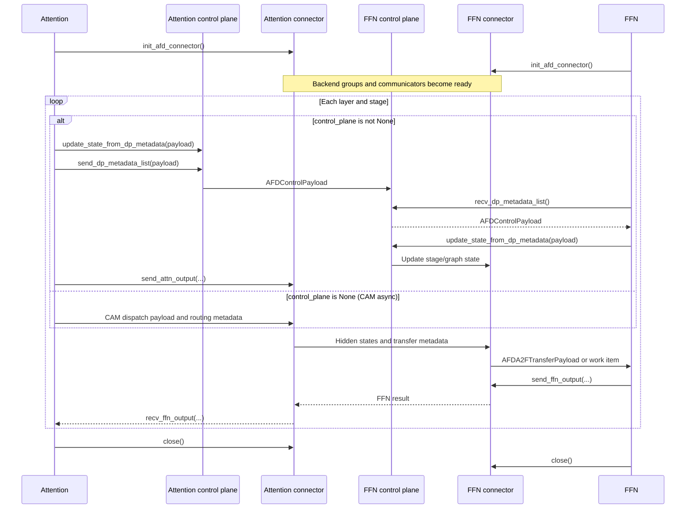

# Connector contracts

## Purpose and boundary

This document owns connector factory behavior, lifecycle, transfer semantics,
control-plane behavior, topology, process groups, payloads, and cleanup. User
installation, launch examples, and deployment recipes remain separate guides.

## Ownership and dependency direction

Connectors consume common configuration and platform operations. Attention,
FFN, and model integration consume connector contracts; connector code must not
depend on role worker implementations.

## Implementation evidence

| Area | Source | Focused validation |
| --- | --- | --- |
| Base surface and lazy factory | [`base.py`](../../../afd_plugin/connectors/base.py), [`factory.py`](../../../afd_plugin/connectors/factory.py) | [`test_base_factory.py`](../../../tests/unit/connectors/test_base_factory.py) |
| Payloads and control-plane codec | [`metadata.py`](../../../afd_plugin/connectors/metadata.py) | Connector unit tests and [`test_forward_context.py`](../../../tests/unit/model_executor/models/test_forward_context.py) |
| CUDA P2P | [`gpu/p2p.py`](../../../afd_plugin/connectors/gpu/p2p.py), [`topology.py`](../../../afd_plugin/distributed/topology.py) | [`test_p2p_connector.py`](../../../tests/unit/connectors/test_p2p_connector.py), [DeepSeek-V2-Lite E2E](../../../tests/e2e/models/deepseek_v2_lite/test_deepseek_v2_lite.py) |
| Ascend CAMP2P | [`npu/camp2p.py`](../../../afd_plugin/connectors/npu/camp2p.py) | [`test_camp2p_connector.py`](../../../tests/unit/connectors/test_camp2p_connector.py), [DeepSeek-V2-Lite E2E](../../../tests/e2e/models/deepseek_v2_lite/test_deepseek_v2_lite.py) |
| Ascend CAM async | [`npu/async_cam.py`](../../../afd_plugin/connectors/npu/async_cam.py) | [`test_async_cam_connector.py`](../../../tests/unit/connectors/test_async_cam_connector.py), [`test_async_cam_npu.py`](../../../tests/e2e/models/deepseek_v2_lite/test_async_cam_npu.py) |
| Process-group construction | [`afd_process_group.py`](../../../afd_plugin/distributed/afd_process_group.py) | Connector initialization tests plus platform E2E paths |

## Factory and construction

`AFDConnectorFactory` stores lazy loaders, so importing the factory does not
import CUDA or Ascend implementations. Built-in names are registered at module
load time. `create_connector(rank, local_rank, vllm_config, afd_config=None)`
parses configuration when needed, resolves the runtime role rank from the
worker's global DP rank and local PCP/TP coordinates, and constructs the
selected class. Every connector receives that resolved role rank and is only
responsible for mapping it into its backend-specific world rank. A loader must
resolve to an `AFDConnectorBase` subclass; duplicate registration is rejected
unless `replace=True`, and unknown names fail before resource initialization.

The registry method is a usable implementation hook, but the complete public
extension contract is **draft**. Configuration still rejects names outside its
separate hard-coded allow-list, so factory registration alone is insufficient
for an external connector.

Each connector class implements `parse_extra_config()` and construction stores
the resulting immutable `ConnectorExtraInfo` as `extra_info`. The factory can
also parse this information without constructing communication resources,
which lets feature validation use the same connector-owned schema.

## Connector-owned configuration

`additional_config["afd"]["connector_extra_config"]` is an envelope rather
than an `AFDConfig` field. Unknown fields fail in the selected connector parser.

| Connector | Accepted connector-specific fields |
| --- | --- |
| `P2pNcclAFDConnector` | None; the mapping must be empty. |
| `CAMP2pAFDConnector` | `core_num`, optional `attn_core_num` / `ffn_core_num`, `compute_gate_on_attention`, and `quant_mode`. Core counts must be positive; the current runtime rejects gate-on-Attention and any nonzero quantization mode. |
| `CAMAsyncAFDConnector` | `dynamicQuant`, `attn_ranks_per_dp`, `async_moe_ubatching`, `async_moe_num_ubatches`, and `async_moe_split`. Runtime validation further limits dynamic quantization and the optional request/token stage pipeline. |

The common `compute_gate_on_attention` field remains on `AFDConfig` and is the
model-routing selector. CUDA P2P supports both values. CAMP2P also parses a
connector-local field with that name for its operator contract, but the current
synchronous NPU runtime requires both common and connector-local values to be
`false`. CAM async requires the common field to be `true`.

## Current connector modes

| Connector | Platform | World ordering | Control plane | FFN step selection |
| --- | --- | --- | --- | --- |
| `P2pNcclAFDConnector` | CUDA | FFN ranks, then Attention ranks | `P2pNcclAFDControlPlane`; stage DP metadata over a separate NCCL group | `connector.control_plane is not None` |
| `CAMP2pAFDConnector` | Ascend | FFN ranks, then Attention ranks | `CAMP2pAFDControlPlane`; stage DP metadata over Gloo plus HCCL data groups | `connector.control_plane is not None` |
| `CAMAsyncAFDConnector` | Ascend | Attention ranks, then FFN ranks | `None`; routing/token metadata travels with CAM dispatch payloads | `connector.control_plane is None` |

The CUDA P2P mapping requires
`num_attention_ranks >= num_ffn_ranks`. Each FFN rank owns a subgroup containing
itself and consecutive Attention peers; the peers are distributed in blocks that
differ in size by at most one, so an integral A/F ratio is not required. CAMP2P also
requires at least as many Attention ranks as FFN ranks; its control and HCCL
groups remain connector-owned. CAM async maps role ranks directly into an
Attention-first world and distributes routed experts across FFN ranks.

These are current implementation facts, not approved long-term extension
contracts. Individual connectors remain sections of this document until they
have independent stable ownership.

## Current base surface

`AFDConnectorBase` defines the lifecycle and data-plane shape below. Its
`control_plane: AFDControlPlane | None` attribute is the explicit runtime
selector: synchronous connectors install a control-plane object during
construction, while CAM async leaves it as `None`. Its `attn_size` and `ffn_size`
attributes describe the transfer layout the concrete connector owns, including
how many Attention peers one FFN rank has.

| Surface | Caller and current responsibility |
| --- | --- |
| `parse_extra_config(raw)` | Connector class parses and validates its closed configuration schema without creating communication resources. |
| `init_afd_connector()` | Owning worker/runner creates backend groups, communicators, operator registrations, and topology-derived state after the device runtime is ready. |
| `is_initialized` | Reports whether backend communication resources are usable. |
| `close()` | Owning runtime releases connector-owned resources during shutdown; cleanup is expected to be safe after partial initialization. |
| `send_attn_output(hidden_states, metadata, **kwargs)` | Attention sends one layer/stage tensor and transfer description, plus model-owned optional routing logits or token-aligned input IDs. |
| `recv_ffn_output(**kwargs)` | Attention receives the matching FFN result. |
| `recv_attn_output(ubatch_idx=None, **kwargs)` | FFN receives an `AFDA2FTransferPayload`. |
| `send_ffn_output(ffn_output, metadata, **kwargs)` | FFN returns a result using metadata/state from the matching receive. |

`AFDControlPlane` is a separate abstract surface reached through
`connector.control_plane`:

| Surface | Caller and current responsibility |
| --- | --- |
| `update_state_from_dp_metadata(payload)` | Applies local stage shape/graph/warmup state to the owning connector without sending it. |
| `send_dp_metadata_list(payload)` | Moves `AFDControlPayload` from Attention to FFN for control-plane-driven connectors. |
| `recv_dp_metadata_list()` | Blocks on and returns the next control payload that drives an FFN step. |

CAM async additionally exposes connector-driven work-item methods used by the
FFN daemon and a connector-side expert-selection path. Those methods are not
part of the current abstract base and remain **draft**. Issue
[#107](https://github.com/JiusiServe/afd-plugin/issues/107) completed the
control-plane separation but did not establish a public work-item protocol.

## A2E tile layout

`afd_plugin/a2e_layout.py` is the one place that derives the tile an A2E transfer
moves. The host-side operators pair an FFN rank with strided Attention peers
(`r, r + ffn_size, ...`) and read one equal tile per peer in both directions, so
the row count a peer writes, the rows the FFN rank reads per peer, and the rows
it computes on are one number, derived from `num_tokens_across_dp_cpu` and one
shared fallback. The connector, the NPU FFN runner, and the CPU-safe graph-key
helper all call the same helpers, so a change to the layout cannot leave the
send, the receive, and the graph key disagreeing.

The ids channel that rides with the transfer carries token ids the FFN role's
router indexes its token-to-expert table with, so the rows it delivers have to be
the rows the router sees. `afd_plugin/compat/patches/npu/hash_ids_alignment.py`
patches the pinned vLLM-Ascend fused selector to keep ids that already describe
every router row instead of re-aligning them to a sequence-parallel layout the
FFN role does not use.

## Payload and metadata ownership

The current plugin-owned objects are:

| Object | Current responsibility | Stability |
| --- | --- | --- |
| `AFDDPMetadata` | CPU token counts plus DP/SP-compatible sizing helpers. It adapts upstream-like metadata into a plugin-owned representation. | Wire representation is the candidate contract; helper surface is draft. |
| `AFDControlPayload` | Stage-to-DP-metadata mapping plus graph-capture, warmup, and profile flags. | Candidate control envelope. |
| `AFDTransferMetadata` | Layer, stage, positive split lengths, total-token validation, and optional backend state. | **Draft** under [#88](https://github.com/JiusiServe/afd-plugin/issues/88). |
| `AFDTransferState` | Empty base for backend-specific state such as CAMP2P handles or async CAM state. | **Draft** under [#88](https://github.com/JiusiServe/afd-plugin/issues/88). |
| `AFDA2FTransferPayload` | Attention-to-FFN hidden states, common metadata, and optional router logits or token-aligned input IDs. | **Draft** and scheduled for state splitting in [#105](https://github.com/JiusiServe/afd-plugin/issues/105). |
| `AFDF2ATransferPayload` | Structured routed/shared FFN outputs where the backend needs both. | **Draft** with the transfer-state work. |
| `AFDForwardContextMetadata` | Stage/slice information and a live connector reference used by model execution. | **Draft**; model-facing ownership is unresolved. |

The control-plane codec serializes only plugin-owned primitive data: integer
stage keys, token-count lists, max counts, and graph/warmup/profile boolean
flags. It encodes JSON,
sends a size followed by a `uint8` tensor, and reconstructs
`AFDControlPayload`; it does not serialize a vLLM `DPMetadata` object. Tensor
data-path layout remains connector-specific.

`AFDTransferMetadata` is passed from receive through compute to the matching
send. The caller must not discard or substitute the matching
`AFDTransferContext.states` value while a backend operation still depends on
it. The concrete contents and ownership of
asynchronous handles are intentionally not declared stable until #88 and #105
are resolved.

Model-specific tensors remain explicit payload fields rather than transfer
state. P2P can send optional router logits and one-dimensional, token-aligned
`torch.int32` input IDs after hidden states. CAMP2P sends the same ids through
the A2E operator's ids channel, which the receiving FFN rank selects with
`recv_input_ids`; both roles derive that mode from the model's
`afd_requires_input_ids` declaration, because the operator only writes the ids
slot in the mode the sender chose. FFN requests only the fields its
model declares, concatenates them with the same per-peer token order as hidden
states, and returns them in `AFDA2FTransferPayload`. The input-ID path supports
DeepSeek V4's native hash router and has graph-stable receive buffers; it does
not make input IDs mandatory for other models or connectors.

## Lifecycle and sequencing

The current lifecycle is:

```text
constructed -> initialized -> control/state prepared -> data exchanges -> closed
                    |                    ^                    |
                    +--------------------+--------------------+
                               repeated steps
```



Construction is device-light; initialization owns backend discovery and
communication setup. Both role runtimes construct their connectors during
device initialization and defer the collective `init_afd_connector()` until
after their model weights are loaded (Attention at the end of
`load_model()`, FFN from `initialize_from_config()`), so Attention and FFN
weight loading overlap across roles before the cross-role rendezvous.
Synchronous connectors receive/apply control metadata before tensor transfer
so they can derive shapes and graph buffers. CAM async does not use that
control plane: dispatch payloads determine layer and token shape, and the FFN
loop blocks on connector work. Closing must happen after work stops and must
clear connector registries, pending queues, communicators, and process groups
owned by that connector.

The data-path sequence for synchronous connectors is Attention send, FFN
receive, FFN compute, FFN send, then Attention receive for each layer/stage.
CAM async may queue Attention-side payload state and completes it in FIFO order
for each stage; the concrete connector validates that required top-k/routing
metadata is present.

## Topology and resource ownership

| Connector | Connector-owned resources | Topology constraints and mapping |
| --- | --- | --- |
| CUDA P2P | AFD process group, PyNccl data communicators, separate NCCL metadata group, compiled custom-op communicator registry, and graph-oriented receive buffers/state. | Requires `A >= F`. One FFN rank is grouped with a consecutive block of Attention ranks in FFN-first ordering; the blocks differ in size by at most one, and hold `A/F` ranks each when `F` divides `A`. |
| Ascend CAMP2P | AFD process group, one HCCL communication group per ubatch, FFN HCCL state, Gloo metadata group, custom-op state and transfer handles. | FFN-first ordering and `A >= F`; group construction derives each FFN/Attention mapping. |
| Ascend CAM async | Attention-first HCCL group, plugin-owned routed-only CAM operator state, per-stage pending Attention payload queues, and connector work-item state. | Role ranks map into a combined Attention-first world; Compact metadata determines the actual layer and expert interval; counts.sum() gives this chunk’s routed token count. |

The common process-group helper creates a plugin-owned group while temporarily
switching PyTorch's default group so vLLM parallel-state helpers initialize
against it. It currently calls private PyTorch/vLLM symbols and is therefore an
upgrade-sensitive compatibility boundary, not a third-party process-group API.

The worker owns the connector object and calls `close()`. The connector owns
the groups/communicators it creates and the control-plane object it exposes;
the control plane does not have an independent lifetime. Model code may invoke
connector data-path methods through forward metadata but does not own those
resources.

## Failure behavior

- Invalid connector names, subclasses, role ranks, or topology fail before
  communication starts.
- Missing CUDA/Ascend/CAM operators fail at connector initialization with a
  backend-specific runtime error.
- Calls that require initialization, transfer state, routing metadata, or a
  matching tensor shape fail at the concrete connector boundary.
- Callers must branch on `connector.control_plane is None` before using the
  control-plane interface. GPU runners require a non-`None` control plane;
  CAM async instead exposes connector-driven work-item methods.
- FFN daemon loop failures are propagated by the owning runtime; connectors do
  not swallow compute or communication errors.
- A compiled forward runs the connector's Python once, at trace time, so anything
  the transfer size depends on has to come from the tensor the call carries or
  from state the runtime refreshes per step. The operator implementations size
  the transfer from the payload they are given; a step whose tile the layout
  cannot represent fails on the host with both row counts rather than on device.
- Partial initialization must remain closeable. Connector changes must test
  cleanup and retry/reinitialization behavior appropriate to their backend.

## Candidate invariants

The following RFC candidates are non-normative while this document is draft:

- `XFER-INV-001`: control-plane wire data uses plugin-owned payloads rather
  than serialized vLLM-internal metadata objects.
- `XFER-INV-002`: a transfer is identified by layer, stage, and token layout;
  its receive-owned backend state remains associated with the matching send.
- `XFER-INV-003`: the Attention peers of one FFN rank write one tile each, of the
  same row count, and the FFN rank reads exactly those rows from every peer. A
  peer that writes fewer rows does not shorten the receive: the operator reads
  past its payload, into its scales and then its activations. A compiled step
  cannot pad its payload, so the layout has to keep the peers' row counts equal
  before the transfer, and eager steps fail fast on a step the layout cannot
  represent.
- `LIFE-INV-001`: connector initialization and cleanup own all connector-created
  communication resources and do not transfer that lifetime to model code.
- `CAP-INV-001`: runtimes choose control-driven or connector-driven FFN steps
  from the explicit optional `connector.control_plane` interface, not a
  concrete class-name check.

The current metadata/state/payload shape, `AFDControlPlane` surface, and
connector-driven work-item methods are explicitly excluded from stable
contracts.

## Upstream relationship and validation requirements

Changes must validate topology, process-group lifecycle, payload round trips,
and connector-specific cleanup using the unit paths above. A payload change
must update all producers, consumers, codec tests, model handoffs, and both role
runtimes. A process-group change requires review against the pinned PyTorch and
vLLM private symbols. Platform and multi-rank claims require the matching E2E
evidence.

## Limitations and open issues

Whether `AFDConnectorBase` or `AFDControlPlane` is public, how
connector-driven work-item methods should be represented, and how
metadata/state ownership is divided remain open. See
[#88](https://github.com/JiusiServe/afd-plugin/issues/88) and
[#105](https://github.com/JiusiServe/afd-plugin/issues/105).

The `AFDControlPlane` split removes control-plane methods from
`AFDConnectorBase`, so CAM async no longer implements semantic no-ops. Its
connector-driven work-item methods still live outside the abstract base. The
configuration allow-list is not derived from the factory registry, and
`AFDA2FTransferPayload` combines common data with backend state.
Connector-owned typed configuration implements the decision from
[#89](https://github.com/JiusiServe/afd-plugin/issues/89), but it does not by
itself make factory registration a public extension contract.

Operational material: [NCCL P2P guide](../../gpu/NCCL_P2P_CONNECTOR_USER_GUIDE.md),
[CAM P2P guide](../../npu/CAM_P2P_CONNECTOR_USER_GUIDE.md),
[CAM async guide](../../npu/CAM_ASYNC_CONNECTOR_USER_GUIDE.md), and
[connector overview](../../../afd_plugin/connectors/README.md).
