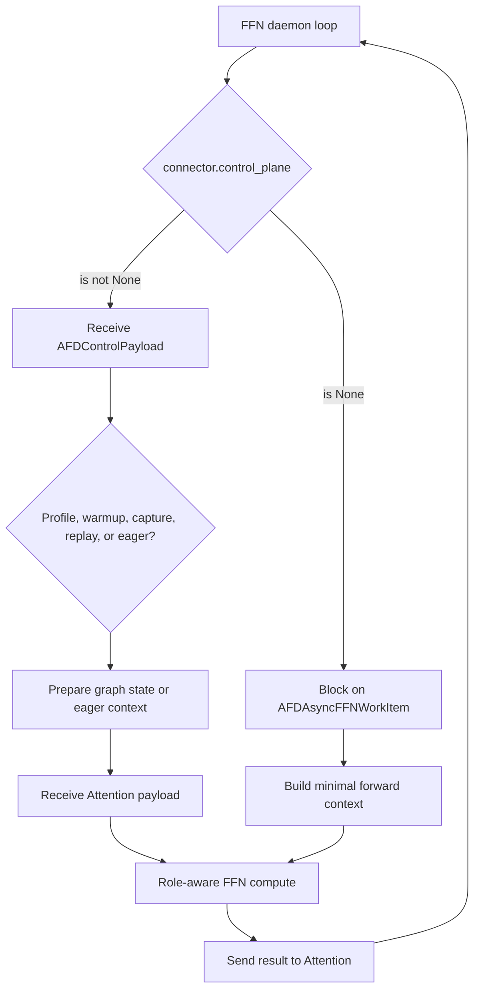

# FFN runtime

## Purpose and boundary

This document is the primary design for connector-driven FFN lifecycle
orchestration: daemon startup, empty KV-cache behavior, scheduler rejection,
compute handoff, error propagation, and shutdown. Transport semantics belong
to [connector contracts](connector_contracts.md); CUDA/Ascend graph, stream,
profiler, native-op, and build mechanisms belong to
[execution platforms](execution_platforms.md).

## Ownership and dependency direction

FFN consumes plugin configuration, connector transport, model-side compute,
platform mechanisms, and EngineCore compatibility. No shared module may depend
on the FFN worker or runner implementation.

## Runtime selection

FFN is launched as a `vllm serve` process, and AFD config normalization selects
its role-specific worker when `worker_cls="auto"`. It does not serve requests.
Attention and FFN may be started in either order. Send API traffic only to
Attention.

| Platform | Worker | Model runner | Current connectors |
| --- | --- | --- | --- |
| CUDA | `afd_plugin.v1.worker.AFDFFNWorker` | `GPUFFNModelRunner` | `P2pNcclAFDConnector` |
| NPU | `afd_plugin.v1.worker.npu.AFDNPUFFNWorker` | `AFDNPUFFNModelRunner` | `CAMP2pAFDConnector`, `CAMAsyncAFDConnector` |

GPU and NPU runtimes use separate internal class paths. `AFDNPUFFNModelRunner`
inherits vLLM-Ascend `NPUModelRunner` directly instead of inheriting the GPU
`GPUFFNModelRunner`. Shared AFD semantics are kept in config, connector,
metadata, validation, and small helper functions rather than through a
cross-device inheritance chain.

CUDA launch shape:

```bash
vllm serve <model> \
  --additional-config '{"afd":{"role":"ffn","connector":"P2pNcclAFDConnector","host":"127.0.0.1","port":1239,"num_attention_ranks":1,"num_ffn_ranks":1}}'
```

Ascend launch shape:

```bash
VLLM_PLUGINS=ascend,afd vllm serve <model> \
  --additional-config '{"afd":{"role":"ffn","connector":"CAMP2pAFDConnector","host":"127.0.0.1","port":1239,"num_attention_ranks":1,"num_ffn_ranks":1}}'
```

## Initialization and empty KV cache

The common FFN initialization sequence is:

```text
vLLM worker construction
  -> validate AFD config, role, connector, and selected worker class
  -> validate the paired V1 or V2 deployment contract
  -> initialize the matching upstream device worker
  -> construct the AFD FFN model runner
  -> derive the role-local AFD rank from DP/TP ranks when needed
  -> load the role-aware FFN model
  -> initialize an empty KV-cache surface
  -> initialize the connector
  -> start the background FFN loop
```

FFN does not own request KV blocks. Both workers return an empty KV-cache spec,
and both runners no-op KV-cache initialization. `compile_or_warm_up_model()`
returns `0.0`; warmup and graph capture, when supported, are driven later by
connector metadata. Because the FFN EngineCore skips that upstream warmup path,
the NPU worker performs vLLM-Ascend's CPU-binding step once immediately before
starting its connector daemon when `enable_cpu_binding` is enabled. The
EngineCore compatibility patch keeps FFN daemon mode out of upstream
scheduler/KV-cache startup assumptions and selects the daemon busy loop. See
[compatibility and patches](compatibility_and_patches.md).

The worker owns the daemon thread, shutdown event, and captured loop error.
The model runner owns the model, connector, profiler, and graph cache. The
connector owns transport/process-group resources.

## ModelRunnerV2 pairing

FFN remains connector-driven when the upstream configuration selects
ModelRunnerV2. It does not adopt native V2 request state or scheduler-driven
execution:

- CUDA temporarily substitutes `GPUFFNModelRunner` at the native V2
  construction seam inside `Worker.init_device()`; the existing AFD runner is
  still the runtime object.
- Ascend always constructs `AFDNPUFFNModelRunner`. When V2 is selected, its
  connector-driven forward enters the upstream MRV2 forward-context shape so
  Ascend-specific state is installed in `additional_kwargs`.
- Both workers run the same V2 topology and feature validator as the paired
  Attention role before constructing communication resources.

The V2 pair therefore requires the synchronous platform connector,
`compute_gate_on_attention=false`, PP/PCP/DCP size 1, configured role ranks
equal to DP x TP, static EP, a registered AFD model, and no DBO or ubatching.
CUDA uses `P2pNcclAFDConnector`; Ascend uses `CAMP2pAFDConnector`. These limits
describe the pair even though only Attention inherits a native V2 runner.

## Daemon step selection

The worker selects one of two FFN step paths from the optional
`connector.control_plane` interface:

| Selection state | Connectors | Worker behavior |
| --- | --- | --- |
| `control_plane is not None` | `P2pNcclAFDConnector`, `CAMP2pAFDConnector` | Call `control_plane.recv_dp_metadata_list()`, then profile, warm, capture, replay, or execute its stage map. |
| `control_plane is None` | `CAMAsyncAFDConnector` (NPU only) | Block directly on a connector work item; no separate DP-metadata control plane. |

The connector-driven path exists only on Ascend. GPU FFN supports
control-plane-driven connectors exclusively: `GPUFFNModelRunner` asserts
`connector.control_plane is not None` at construction, and the GPU daemon loop
raises `NotImplementedError` if a connector without a control plane is ever
installed.



### Control-plane-driven loop

```text
FFN initialize_from_config(...)
  -> initialize empty KV-cache surface
  -> initialize connector
  -> start daemon thread

daemon thread:
  -> connector.control_plane.recv_dp_metadata_list()
  -> inspect stage metadata plus profile/warmup/capture flags
  -> capture/warm matching graph, or execute FFN forward
  -> synchronize the current accelerator
  -> repeat
```

### Connector-driven loop

The Ascend worker checks `connector.control_plane`. When it is `None`, as for
CAM async, the worker calls `execute_connector_driven_step()` instead of a
control-plane receive. For each layer, the runner:

1. receives a normalized `AFDAsyncFFNWorkItem` from
   `connector.recv_ffn_work_item(...)`; CAM metadata supplies the actual layer
   index plus routed/shared token counts, and the connector slices tensors
   from operator capacity down to those counts;
2. builds a single-stage forward context sized to the work item's token count,
   with `dp_metadata = None`;
3. installs the work item's `AFDTransferContext.metadata` as `afd_metadata`;
4. calls the role-aware FFN compute, forwarding the routed/shared MoE compute
   payloads (`group_list`, `dynamic_scales`, `expand_x_shared`,
   `dynamic_scales_shared`) from the work item's `AFDAsyncTransferState` on
   `AFDTransferContext.states`;
5. returns the routed/shared outputs through
   `connector.send_ffn_work_item_output(...)`, which also handles the
   zero-routed-token placeholder required by CAM combine-send.

CAM async is eager-only and does not use the FFN graph-control path; the graph
cache is keyed by DP metadata, which does not exist without a control plane.

## Control-plane-driven forward

The current runner contract for one control payload is:

1. Update connector state from the stage-indexed DP metadata.
2. Build the minimal vLLM forward context required by model-side MoE compute.
3. Iterate model layers and sorted stage ids.
4. Receive an `AFDA2FTransferPayload` for the current layer/stage, which
   carries the hidden states plus an `AFDTransferContext` (transfer metadata
   and the backend `AFDTransferState`).
5. Install stage DP metadata and transfer metadata at
   `ForwardContext.additional_kwargs["afd_metadata"]`.
6. Set vLLM's current MoE layer index when the upstream context exposes the
   layer list.
7. Compute FFN output and send it to Attention with the same layer/stage
   identity, passing the same `AFDTransferContext` back into
   `send_ffn_output()` so the connector can reuse its receive-time state.

On Ascend, `is_profile` is also forwarded into the minimal forward context so
vLLM-Ascend preserves its balanced dummy-MoE and communication state during
the split memory-profile run. CUDA carries the field in the common envelope
but does not need a separate FFN profile-context branch.

On CUDA, `GPUFFNModelRunner` is a plugin-owned minimal runner. It invokes
`model.compute_ffn_output(hidden_states, layer_idx)` when provided and
otherwise passes hidden states through; production AFD model paths are
expected to provide the compute method. On Ascend, `AFDNPUFFNModelRunner`
directly calls the role-aware model. The control-plane-driven path (CAMP2P)
does not thread per-transfer payload fields through `compute_ffn_output`:
CAMP2P's `CAMP2PTransferState` (operator sizes, the A2E-returned
`atten_batch_size`, `x_active_mask`, and HCCL endpoint name) rides on
`AFDTransferContext.states` and the forward context between the receive and
send phases.

Ascend translates AFD-level token counts to the DP-level token-count vector
expected by the upstream forward context. When TP expands Attention rank
counts beyond DP metadata width, token counts are replicated per TP rank and
then aggregated for each FFN rank.

## Role-aware model loading

The FFN process uses vLLM's model loader, while plugin-owned model integration
constructs FFN MLP/expert components plus shared components needed by the
upstream lifecycle, without Attention modules. FFN runners do not sample
tokens. GPU LoRA mutation methods return unsupported/no-op results; the NPU
runner rejects sampling explicitly.

Detailed model construction and weight ownership remain in
[model integration](model_integration.md).

## Graph dispatch contract

For connectors with a control plane, the graph cache key is derived from each
stage's token counts. Ascend also includes A/F topology when it must aggregate
Attention counts to FFN counts. The shared dispatch states are eager, warmup,
capture, and replay:

- warmup runs FFN compute after applying control state;
- capture applies connector control state before entering the formal device
  graph so control-plane work is not replayed;
- replay runs an existing graph for the matching key;
- a missing graph falls back to eager execution.

The Attention control payload is the source of warmup/capture flags. Device
graph objects, pools, supported modes, and exact cache behavior are specified
by [execution platforms](execution_platforms.md).

## Failure propagation and shutdown

`execute_model()` on either worker raises immediately if the native scheduler
tries to drive FFN work. The runner also rejects a normal execution call that
lacks its connector metadata/work item.

The daemon catches failures, stores the original exception, logs it, and makes
the error visible through `raise_ffn_loop_error_if_any()`. Re-entering startup
or completing shutdown therefore surfaces an earlier background failure.

Shutdown ordering is:

```text
signal daemon event
  -> runner stops profiler and closes connector
  -> join daemon thread with a bounded timeout
  -> surface stored loop error
  -> delegate remaining worker/runner shutdown upstream
```

Connector receive calls may be blocking; the connector's `close()` behavior
is responsible for releasing its communication resources so shutdown can
complete.

## Candidate invariants

The following RFC candidate remains non-normative while this document is
draft:

- `ROLE-INV-001` (FFN part): FFN remains connector-driven and rejects
  scheduler execution.

The optional control-plane and connector work-item surfaces, and the current
`AFDTransferContext`/`AFDTransferState` transfer payload shape, are not stable
contracts.

## Upstream relationship and validation requirements

Changes must be compared with the pinned vLLM worker and EngineCore behavior
and, for Ascend, with the tested runtime evidence. Run the FFN runner,
EngineCore patch, NPU runtime, and serving tests listed in the metadata.
Control-plane selection or work-item changes also require connector and CAM
async model E2E coverage.

## Limitations and open issues

Current shared limits are the supported vLLM release, connector-driven FFN,
and registered role-aware model integrations. V1 native DBO accepts exactly
two ubatches. A V2-paired FFN rejects DBO/ubatching and uses the same AFD FFN
runner with a V2-compatible construction and forward-context seam. CAM async
instead uses eager connector work items and may enable its distinct two-stage
MoE pipeline. Platform-specific limits are centralized in
[execution platforms](execution_platforms.md#tested-runtime-matrix).

Issue [#107](https://github.com/JiusiServe/afd-plugin/issues/107) completed the
optional control-plane split. Connector metadata ownership, transfer state
separation, and the public shape of the connector work-item interface remain
open in [#88](https://github.com/JiusiServe/afd-plugin/issues/88) and
[#105](https://github.com/JiusiServe/afd-plugin/issues/105).
