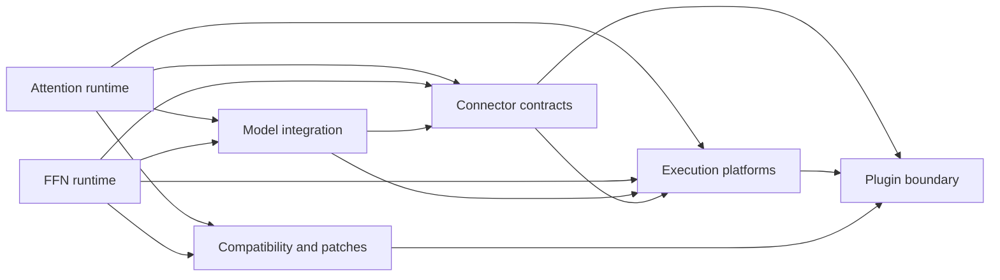

# AFD module design

This directory is the routing and ownership layer for AFD module design. Each
document declares its own status. A document remains `draft` until its owners
verify boundaries, invariants, and validation evidence. The documents record
plugin, role runtime, connector, model, platform, compatibility, and E2E
testing contracts; open interfaces remain explicitly draft.

## Reading order

1. [Plugin boundary](plugin_boundary.md) for registration, configuration, and
   supported upstream boundaries.
2. [Attention runtime](attention_runtime.md) or
   [FFN runtime](ffn_runtime.md) for role lifecycle and execution flow.
3. [Connector contracts](connector_contracts.md) and
   [model integration](model_integration.md) for the handoff between roles.
4. [Execution platforms](execution_platforms.md) for CUDA/NPU mechanisms.
5. [Compatibility and patches](compatibility_and_patches.md) before modifying
   upstream compatibility behavior.
6. [E2E testing](e2e_testing.md) after the production modules, for hardware
   gate structure, pass criteria, and rules for adding cases.

## Dependency direction

Dependencies flow from role and integration modules toward shared boundaries;
platform and compatibility modules adapt those boundaries to upstream
runtimes. A lower-level document must not depend on a role implementation.

```text
attention_runtime ----+----> connector_contracts ----> plugin_boundary
                      |                |
ffn_runtime ----------+                +----> execution_platforms
                      |
model_integration ----+----> execution_platforms

attention_runtime ----+
ffn_runtime ----------+----> compatibility_and_patches ----> plugin_boundary
```



## Production path routing

Every shipped Python path, native build path, and packaging file has one
primary document. Related documents may discuss a path but do not own its
contract. File-level entries deliberately resolve mixed directories.

| Primary document | Production paths |
| --- | --- |
| [Plugin boundary](plugin_boundary.md) | `afd_plugin/__init__.py`, `afd_plugin/config.py`, `afd_plugin/config_utils.py`, `afd_plugin/envs.py`, `afd_plugin/validation.py`, `afd_plugin/py.typed`, `afd_plugin/v1/__init__.py`, `afd_plugin/v1/worker/__init__.py`, `afd_plugin/v1/worker/npu/__init__.py`, `pyproject.toml` |
| [Attention runtime](attention_runtime.md) | `afd_plugin/v1/worker/attention_metadata.py`, `afd_plugin/v1/worker/attention_model_runner.py`, `afd_plugin/v1/worker/attention_model_runner_v2.py`, `afd_plugin/v1/worker/attention_worker.py`, `afd_plugin/v1/worker/ubatch_wrapper.py`, `afd_plugin/v1/worker/npu/attention_model_runner.py`, `afd_plugin/v1/worker/npu/attention_model_runner_v2.py`, `afd_plugin/v1/worker/npu/attention_worker.py` |
| [FFN runtime](ffn_runtime.md) | `afd_plugin/v1/worker/ffn_model_runner.py`, `afd_plugin/v1/worker/ffn_worker.py`, `afd_plugin/v1/worker/npu/ffn_model_runner.py`, `afd_plugin/v1/worker/npu/ffn_worker.py` |
| [Connector contracts](connector_contracts.md) | `afd_plugin/connectors/**/*.py`, `afd_plugin/connectors/npu/bin/**`, `afd_plugin/distributed/**/*.py` |
| [Model integration](model_integration.md) | `afd_plugin/model_executor/**/*.py` |
| [Execution platforms](execution_platforms.md) | `afd_plugin/compat/profiler.py`, `afd_plugin/compat/npu/forward_context.py`, `afd_plugin/compat/npu/ops.py`, `afd_plugin/compat/npu/profiler.py`, `afd_plugin/v1/worker/cuda_graph.py`, `afd_plugin/v1/worker/dbo.py`, `afd_plugin/v1/worker/npu/forward_context.py`, `afd_plugin/v1/worker/npu/mla_graph.py`, `afd_plugin/v1/worker/npu/npu_ubatch_wrapper.py`, `afd_plugin/v1/worker/npu/ubatch_utils.py`, `afd_plugin/v1/worker/npu/ubatching.py`, `csrc/**`, `setup.py`, `MANIFEST.in` |
| [Compatibility and patches](compatibility_and_patches.md) | `afd_plugin/compat/__init__.py`, `afd_plugin/compat/vllm.py`, `afd_plugin/compat/npu/__init__.py`, `afd_plugin/compat/npu/feature_validation.py`, `afd_plugin/compat/npu/runtime.py`, `afd_plugin/compat/npu/runtime_config.py`, `afd_plugin/compat/patches/**/*.py` |

The routing inventory covers runtime and package code under `afd_plugin/**`,
native sources under `csrc/**`, and packaging files that affect shipped
artifacts. Tests, development tools, recipes, generated files, user guides,
and design documents are outside the production ownership inventory.
The repository-level test contract is owned separately by
[E2E testing](e2e_testing.md).

## Document status

| Status | Meaning |
| --- | --- |
| `draft` | Boundaries or evidence still require owner review. Statements describe current intent and are not stable contracts. |
| `normative` | Owners have approved the boundary, invariants, upstream references, and enforcement evidence. |

Only identified invariant blocks in a `normative` document may use `MUST`,
`MUST NOT`, or `SHOULD` as contract terms.

## User and operational guides

Operational guides remain separate from normative module design:

- [NCCL P2P connector guide](../../gpu/NCCL_P2P_CONNECTOR_USER_GUIDE.md)
- [CAM P2P connector guide](../../npu/CAM_P2P_CONNECTOR_USER_GUIDE.md)
- [CAM async connector guide](../../npu/CAM_ASYNC_CONNECTOR_USER_GUIDE.md)
- [Ascend NPU installation](../../../README.md#ascend-npu-installation)
- [Connector overview](../../../afd_plugin/connectors/README.md)
- [Deployment recipes](../../../recipe/README.md)
