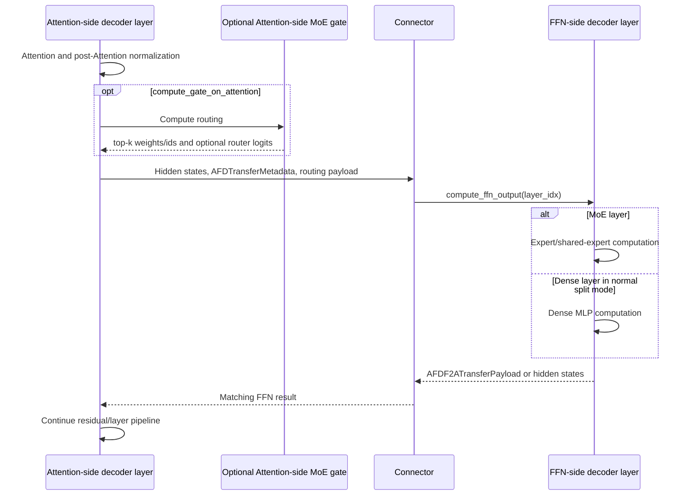

# Model integration

## Purpose and boundary

This document owns model registration, role-aware construction and weight
loading, forward-context metadata access, and model-side AFD execution. Worker
lifecycle and connector transport implementations remain outside this module.

## Ownership and dependency direction

Model integration consumes plugin configuration, connector payload contracts,
and platform mechanisms. It must not reach into concrete worker instances or
make a backend-specific worker class the shared model API.

## Implementation evidence

| Area | Source | Focused validation |
| --- | --- | --- |
| Registration map | [`afd_plugin/__init__.py`](../../../afd_plugin/__init__.py) | [`test_package.py`](../../../tests/unit/package/test_package.py) |
| Role-aware model and weight loading | [`deepseek_v2.py`](../../../afd_plugin/model_executor/models/deepseek_v2.py) | [`test_forward_context.py`](../../../tests/unit/model_executor/models/test_forward_context.py), model and accuracy E2E suites |
| CUDA remote-experts boundary | [`deepseek_v2.py`](../../../afd_plugin/model_executor/models/deepseek_v2.py), [`gpu/p2p.py`](../../../afd_plugin/connectors/gpu/p2p.py) | [`test_p2p_experts_contract.py`](../../../tests/unit/connectors/test_p2p_experts_contract.py), [`test_deepseek_v2_proxy.py`](../../../tests/unit/model_executor/models/test_deepseek_v2_proxy.py) |
| Forward-context adapter | [`forward_context.py`](../../../afd_plugin/model_executor/models/forward_context.py) | [`test_forward_context.py`](../../../tests/unit/model_executor/models/test_forward_context.py) |
| NPU Async CAM stage planning | [`npu/async_cam_ubatching.py`](../../../afd_plugin/model_executor/npu/async_cam_ubatching.py) | [`test_async_cam_ubatching.py`](../../../tests/unit/model_executor/test_async_cam_ubatching.py) |
| Ascend Attention-side gate | [`npu/deepseek_v2_attention_gate.py`](../../../afd_plugin/model_executor/models/npu/deepseek_v2_attention_gate.py) | Attention-gate unit cases in [`test_forward_context.py`](../../../tests/unit/model_executor/models/test_forward_context.py) |
| Ascend CAM layout and execution sidecar | [`npu/async_cam_layout.py`](../../../afd_plugin/model_executor/models/npu/async_cam_layout.py) | Async layout cases in [`test_forward_context.py`](../../../tests/unit/model_executor/models/test_forward_context.py) |
| Ascend CAM orchestration | [`npu/deepseek_v2_async_cam_forward.py`](../../../afd_plugin/model_executor/models/npu/deepseek_v2_async_cam_forward.py) | Async/ubatch unit cases and [`test_async_cam_npu.py`](../../../tests/e2e/models/deepseek_v2_lite/test_async_cam_npu.py) |

## Model registration

`register_afd()` leaves vLLM's native architecture lookups unchanged and
registers lazy AFD wrapper paths under `AFD`-prefixed aliases.

| Checkpoint architecture | AFD registry alias | Registered AFD class |
| --- | --- | --- |
| `DeepseekForCausalLM` | `AFDDeepseekForCausalLM` | `AFDDeepseekForCausalLM` |
| `DeepseekV2ForCausalLM` | `AFDDeepseekV2ForCausalLM` | `AFDDeepseekV2ForCausalLM` |
| `DeepseekV3ForCausalLM` | `AFDDeepseekV3ForCausalLM` | `AFDDeepseekV3ForCausalLM` |
| `DeepseekV32ForCausalLM` | `AFDDeepseekV32ForCausalLM` | `AFDDeepseekV3ForCausalLM` |
| `GlmMoeDsaForCausalLM` | `AFDGlmMoeDsaForCausalLM` | `AFDGlmMoeDsaForCausalLM` |

Only AFD workers switch their worker-local model configuration to the matching
alias before constructing the AFD model runner. Non-AFD workers keep the
checkpoint architecture and resolve to vLLM's native model class.

All registered classes currently share the DeepSeek V2-derived implementation.
The aliases express known compatible architecture families; they do not make
the wrapper a generic MoE model API.

## Role-aware module construction

Non-AFD workers use the pinned vLLM model implementation directly. When an AFD
worker selects an AFD alias, `AFDDeepseekV2DecoderLayer` constructs only the
components needed for the selected role while retaining layer normalization
needed by the split execution.

| Layer/component | Attention role | FFN role |
| --- | --- | --- |
| Attention module and KV-facing computation | Constructed and executed. | Not constructed. |
| MoE with `compute_gate_on_attention=false` | CUDA constructs the native MoE shell with a parameter-free internal-router experts proxy; NPU sends after post-Attention normalization. | Native gate and experts are constructed and executed from connector input. |
| MoE with `compute_gate_on_attention=true` | CUDA keeps the native gate and uses an external-router experts proxy; NPU uses its Attention-side gate helper. | Expert MLP is constructed and consumes transferred router logits or routed payloads without rerunning the gate. |
| Dense MLP, normal mode | Not constructed; output is sent after post-Attention normalization. | Constructed and executed from connector input. |
| Dense MLP with `compute_gate_on_attention=true` | Constructed and executed locally because there is no routed MoE handoff. | Not constructed and a dense-layer FFN compute request is rejected. |
| Embedding, final norm, pipeline placeholders | Created according to the pinned pipeline-rank rules. | Same wrapper lifecycle rules; only role-required parameters are loaded. |

CUDA MoE always splits at the remote-experts boundary while preserving native
`DeepseekV2MoE.forward`. With gate-on-FFN, the proxy asks FFN to run its native
internal-router MoE. With gate-on-Attention, Attention runs the native gate and
FFN executes its external-router experts path. CUDA Attention-side remote
experts currently reject EPLB. The NPU gate helper supports unquantized and
Ascend W8A8 MoE expert computation; unsupported devices or quantization fail
explicitly.

The full AFD model remains decorated with vLLM's compile support. Backend-only
helpers are imported inside the NPU path so CUDA model import does not require
vLLM-Ascend.

## Forward-context contract

The runner installs `AFDForwardContextMetadata` in
`ForwardContext.additional_kwargs["afd_metadata"]`. Model code reads only that
key through `get_afd_metadata_from_forward_context()`; it does not inspect an
ad-hoc `ForwardContext.afd_metadata` attribute. The current metadata supplies
stage/request/token slicing, stage count, optional transaction ID, and a live
connector reference.

Native vLLM dummy runs can bypass the AFD model-runner call site. During those
runs, `use_afd_metadata_provider()` temporarily wraps
`vllm.forward_context.create_forward_context`, lets the runner install the same
`additional_kwargs` entry, and restores the original function in `finally`.
This is a scoped compatibility adapter, not a permanent global provider.

Async MoE ubatching uses a second sidecar key,
`afd_async_moe_ubatch_metadata`, containing upstream Attention metadata and
plugin-owned stage descriptions. The generic adapter owns only `afd_metadata`;
the NPU sidecar and layout conversion live in `models/npu/async_cam_layout.py`,
while `model_executor/npu/async_cam_ubatching.py` contains the pure NPU execution
planner. Both the sidecar shape and the live connector reference are
**draft** while metadata ownership is discussed in
[#88](https://github.com/JiusiServe/afd-plugin/issues/88) and payload state is
split under [#105](https://github.com/JiusiServe/afd-plugin/issues/105).

## Model execution flow

In the generic split path, the Attention wrapper receives the previous FFN
result after the first local layer, executes Attention and normalization,
creates `AFDTransferMetadata` for the current layer/stage, sends hidden states,
and yields at the DBO hook when enabled. After the final layer it receives the
last FFN result and completes the model's pipeline-rank output logic.

The FFN runner calls the causal-LM wrapper's `compute_ffn_output()`, which
dispatches to the selected decoder layer. Normal mode executes that layer's
MLP. Attention-side-gate mode requires connector-produced group/routing and
quantization metadata, executes the Ascend expert path, and can return
separate routed/shared outputs in `AFDF2ATransferPayload`.

CAM async has two model-side variants:

- the standard gate path keeps dense layers on Attention, sends only MoE
  layers with top-k payloads, and delays the matching FFN receive until it is
  needed;
- the experimental two-stage request-boundary path runs dense layers once,
  slices the MoE region by request, installs stage-specific forward context,
  pipelines send/receive across the two stages, and restores parent context
  state on exit.

Connector ordering, work items, and transport buffers remain owned by
[connector contracts](connector_contracts.md); graph and DBO mechanics remain
owned by [execution platforms](execution_platforms.md).

## Role-aware weight loading

The wrapper follows pinned vLLM mappings for stacked projections, expert
weights, speculative-layer skips, pipeline-missing parameters, KV-scale
renaming, shared-expert placement, and redundant experts. AFD adds role
filtering:

- Attention loads Attention/common parameters and skips FFN expert parameters.
  When gate-on-Attention is enabled, MoE gate weights retain the native
  `.mlp.gate` path and are also loadable on Attention, while dense MLP
  parameters remain loadable for locally executed dense layers.
- FFN loads the MLP/expert and required common parameters and skips unrelated
  Attention parameters. In gate-on-Attention mode it also skips dense MLP
  parameters because those layers execute on Attention.
- Model-specific missing, fused, redundant, and pipeline parameters retain the
  upstream skip/mapping behavior instead of being treated as AFD errors.

Any change to these filters must be compared against the pinned upstream
loader and validated on both roles. A successful load set is not evidence that
the other role can be omitted from model/accuracy E2E coverage.

## Failure and resource ownership

- Missing `afd_metadata` on an AFD path fails explicitly; an AFD model alias is
  not an implicit local-forward fallback.
- AFD paths that require a connector, top-k payload, group list, or async stage
  metadata fail when that input is missing.
- Unsupported aux-hidden-state capture, unsupported device gate placement or
  gate quantization, and inconsistent shared-expert dimensions fail explicitly.
- The model owns modules, parameters, local intermediates, and layer
  computation. The runner owns forward-context installation and step
  lifecycle. The connector owns communication resources and transfer state.
- A connector reference in forward metadata grants call access for that
  forward only; model code does not initialize or close it.

## Candidate invariants

The following RFC candidates are non-normative while this document is draft:

- `MODEL-INV-001`: model-side AFD metadata is read from
  `ForwardContext.additional_kwargs["afd_metadata"]`.
- `MODEL-INV-002`: role-aware construction and loading omit components not
  executed by that role while preserving pinned upstream parameter mappings.
- `MODEL-INV-003`: model code owns computation only; runner lifecycle and
  connector resource lifetime do not move into the wrapper.

The live connector reference currently present in forward-context metadata is
not declared a long-term model API.

## Upstream relationship and validation requirements

Changes must be compared with the pinned vLLM DeepSeek V2 implementation and
forward-context contract. Run model unit tests and the affected GPU/NPU model
and accuracy E2E paths; weight-loading changes require role-specific evidence.
Forward-context mutations require restoration/error-path tests, and an
architecture registration change requires package registration plus checkpoint
load evidence.

## Limitations and open issues

The current implementation is DeepSeek-oriented. Metadata ownership and
transfer state decisions remain linked to
[#88](https://github.com/JiusiServe/afd-plugin/issues/88) and
[#105](https://github.com/JiusiServe/afd-plugin/issues/105).

The current `AFDForwardContextMetadata` shape, connector reference, async MoE
sidecar, and architecture aliases remain **draft**. They describe the working
pinned implementation and must not be used as an independent extension promise
until the linked issues and owner review are complete.
