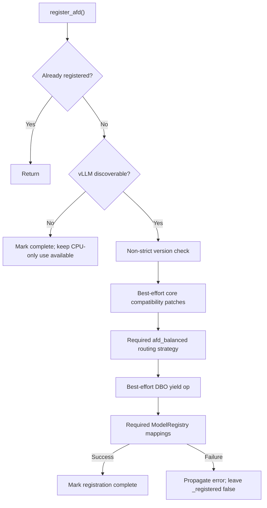

# Plugin boundary

## NPU v0.28 review scope

On NPU, `register_afd` installs the narrow Ascend config namespace patch
before model registration completes, since scheduler construction can call
`get_ascend_config` before a worker exists. Full platform/operator patches
remain deferred. Known already-imported config aliases are rebound without
forcing optional imports; no module scan or code-object mutation is used.
Both parent EngineArgs and spawned-child VllmConfig revalidation install the
required config patches before upstream validation. CPU/CUDA registration
continues without importing the Ascend namespace adapter.

## Purpose and boundary

This document owns plugin registration, public class-path routing, common AFD
configuration and validation, CPU-safe imports, and the supported upstream
environment. Packaging of native platform artifacts belongs to
[execution platforms](execution_platforms.md).

## Ownership and dependency direction

The plugin boundary is the lowest shared AFD layer. Runtime, connector, model,
platform, and compatibility modules may consume it; it must not import their
device runtime dependencies during CPU-safe package, configuration, or
validation imports.

## Implementation evidence

This specification records current behavior and links to the source and tests
that enforce it. RFC #89 settled the current activation and connector
configuration shape; this document does not make the remaining factory or
runtime extension surfaces stable.

| Area | Source | Focused validation |
| --- | --- | --- |
| Package import and registration | [`afd_plugin/__init__.py`](../../../afd_plugin/__init__.py), [`pyproject.toml`](../../../pyproject.toml) | [`test_package.py`](../../../tests/unit/package/test_package.py) |
| Configuration schema and parsing | [`afd_plugin/config.py`](../../../afd_plugin/config.py), [`afd_plugin/config_utils.py`](../../../afd_plugin/config_utils.py) | [`test_config.py`](../../../tests/unit/config/test_config.py) |
| Runtime wiring validation | [`afd_plugin/validation.py`](../../../afd_plugin/validation.py) | [`test_validation.py`](../../../tests/unit/config/test_validation.py), [`test_runtime_classpaths.py`](../../../tests/unit/v1/worker/test_runtime_classpaths.py) |
| Environment switches | [`afd_plugin/envs.py`](../../../afd_plugin/envs.py) | [`test_envs.py`](../../../tests/unit/test_envs.py) |
| Lazy runtime exports | [`afd_plugin/v1/worker/__init__.py`](../../../afd_plugin/v1/worker/__init__.py), [`afd_plugin/v1/worker/npu/__init__.py`](../../../afd_plugin/v1/worker/npu/__init__.py) | [`test_runtime_classpaths.py`](../../../tests/unit/v1/worker/test_runtime_classpaths.py) |

## Import and packaging boundary

The installed vLLM entry point is `afd = "afd_plugin:register_afd"` in the
`vllm.general_plugins` group. The package has no mandatory runtime dependency;
the `vllm` extra pins the supported vLLM release, and the supported Python
range is declared in `pyproject.toml`.

Importing `afd_plugin`, `afd_plugin.config`, or `afd_plugin.validation` is
CPU-safe. The package root imports configuration only. CUDA, Ascend, vLLM
worker, and model modules are loaded lazily through `__getattr__`, connector
factory loaders, or `register_afd()`. This separation supports package and
configuration inspection on development hosts without vLLM or a device
backend.

## Registration lifecycle

`register_afd()` is process-local and guarded by `_registered`. Its current
order and failure behavior are:

| Step | Behavior | Failure policy |
| --- | --- | --- |
| 1 | Return if registration already completed. | No-op. |
| 2 | Detect vLLM without importing it. If absent, mark registration complete. | CPU-only use remains available. |
| 3 | Check the installed vLLM version with `strict=False`. | Warning/check failures are logged at debug level and registration continues. |
| 4 | Import the four core compatibility patch modules. | Best effort. They share one `try` block, so an early import failure can leave a partial patch set and skip later imports. |
| 5 | Register the plugin-owned `afd_balanced` routing-simulator strategy. | Required when vLLM is installed. An error propagates and `_registered` remains false. |
| 6 | Register the DBO yield custom op. | Best effort; failure is logged at debug level. |
| 7 | On NPU, install the required Ascend config namespace adapter; then register the AFD model architecture mappings with vLLM `ModelRegistry`. | Required when vLLM is installed. An error propagates and `_registered` remains false. |
| 8 | Mark registration complete. | Later calls are no-ops. The NPU config namespace adapter is installed before completion; remaining Ascend patches are deferred to config/worker startup. |

Patch details and the risks of best-effort application are owned by
[compatibility and patches](compatibility_and_patches.md). Model mappings are
owned by [model integration](model_integration.md).

## Configuration channel

The canonical input is `VllmConfig.additional_config["afd"]`. Namespace
presence is the activation signal: `parse_optional_afd_config()` returns
`None` when it is absent, while role runtimes call `parse_afd_config()` and
raise if the required namespace is missing. Unknown top-level AFD keys are rejected and connector-specific values
must be placed under `connector_extra_config`.

| Canonical key | Default | Current meaning |
| --- | --- | --- |
| `connector` | `P2pNcclAFDConnector` | Connector factory name selected from the built-in supported-name allow-list. |
| `async_dp` | `false` | Enables AFD async-DP compatibility behavior; currently valid only with `CAMAsyncAFDConnector`. |
| `role` | `attention` | Process role: `attention` or `ffn`. |
| `host`, `port` | `127.0.0.1`, `1239` | Connector rendezvous/control endpoint inputs. |
| `num_attention_ranks`, `num_ffn_ranks` | `1`, `1` | AFD role-group sizes used by topology construction. |
| `compute_gate_on_attention` | `false` | Moves supported gate/MoE routing work to Attention. CUDA supports both gate placements at the remote-experts boundary; synchronous CAMP2P still requires `false`, while CAM async requires `true`. |
| `connector_extra_config` | `{}` | Envelope key parsed by the selected connector into a typed `ConnectorExtraInfo`; it is not stored on `AFDConfig`. |

The compatibility aliases `afd_connector`, `afd_role`, `afd_port`, `afd_host`,
and `async` normalize to canonical fields. Supplying an alias and its canonical
field together is rejected. Boolean-like strings and integer-like values are
normalized; invalid types fail during parsing. The former `afd_extra_config`
alias and untyped `extra_config` field are no longer accepted.

Role rank is runtime state derived from the global DP rank and local PCP/TP
coordinates. It is resolved once by the connector factory and is not an
`AFDConfig` field.

Connector construction parses `connector_extra_config` through the selected
connector class. P2P accepts only an empty mapping; CAMP2P and CAM async each
define a closed, typed schema and reject unknown fields. The detailed schemas
belong to [connector contracts](connector_contracts.md) and the operational
connector guides.

`AFDConfig.compute_hash()` currently includes connector, async mode, role, and
both role counts. This is an implementation detail used by
graph-affecting configuration paths, not a complete serialization or public
configuration identity.

## Validation and worker selection

Common configuration validation is CPU-safe and checks role, optional expected
role, supported connector name, async/connector pairing, P2P topology,
endpoint, positive role counts, and role-rank range. Connector-specific schema
and feature validation runs when the factory resolves the selected connector.
When `worker_cls="auto"`, config normalization selects the AFD worker from the
active platform and configured role after upstream platform normalization.
Role mismatches, unsupported platforms, non-standard Ascend workers, and
incorrect explicit worker paths fail before device execution. CAM async always
uses the NPU worker family.

When upstream selects ModelRunnerV2, role workers apply an additional CPU-safe
deployment validator before communication resources are created. Both roles
must use the platform's synchronous connector, FFN-side gate placement,
PP/PCP/DCP size 1, role ranks equal to DP x TP, static EP, and a registered AFD
model; DBO, ubatching, elastic EP, EPLB, sequence-parallel MoE, and compile SP
are rejected. CUDA V2 requires `P2pNcclAFDConnector`; Ascend V2 requires
`CAMP2pAFDConnector`. Graph-mode details belong to
[execution platforms](execution_platforms.md).

The following internal paths remain loadable for compatibility with existing
commands:

| Platform | Attention | FFN | Related runtime path |
| --- | --- | --- | --- |
| CUDA | `afd_plugin.v1.worker.AFDAttentionWorker` | `afd_plugin.v1.worker.AFDFFNWorker` | `AFDAttentionModelRunner`, `GPUFFNModelRunner`, and `AFDUBatchWrapper` are lazy exports; V2 Attention is constructed internally from `attention_model_runner_v2.py` |
| NPU | `afd_plugin.v1.worker.npu.AFDNPUAttentionWorker` | `afd_plugin.v1.worker.npu.AFDNPUFFNWorker` | `AFDNPUAttentionModelRunner`, `AFDNPUAttentionModelRunnerV2`, and `AFDNPUFFNModelRunner` in the same module namespace |

New commands should omit `--worker-cls`. These paths may change with the pinned
runtime integration and are not stable third-party extension interfaces.

## Environment boundary

`afd_plugin.envs` centralizes diagnostic and offline-scheduler environment
names. `AFD_CAMP2P_STUB_IO` and `AFD_FORCE_BALANCED_TOPK_IDS` have boolean
helpers; offline scheduler CSV/rank/request-index names are exported for their
consumers. Environment switches do not replace `additional_config["afd"]` as
the activation or topology channel.

`VLLM_USE_V2_MODEL_RUNNER` belongs to the upstream runtime and selects the V1
or V2 construction path; it does not activate AFD or relax AFD validation.

## Failure and ownership rules

- Parsing and validation errors are caller-visible and occur before connector
  or device resource creation.
- Optional backend discovery must not make CPU-safe imports fail.
- The plugin entry point owns registration state, but does not own connector,
  worker, process-group, or graph lifetime.
- Worker class resolution imports device modules only when the executor
  resolves the normalized class path.
- Model registration is the required end of vLLM registration; compatibility
  bootstrap is currently best effort and therefore must be verified by the
  affected runtime tests.

## Invariants

The following invariants are normative:

- `ENTRY-INV-001`: top-level package, configuration, and validation imports are
  safe without vLLM or a device backend installed.
- `CFG-INV-001`: `additional_config["afd"]` is the canonical configuration
  channel; aliases are compatibility inputs only.
- `ENTRY-INV-002`: registration is idempotent within one process and model
  registration is not reported complete after a required registration error.
- `CFG-INV-002`: invalid role, topology, connector, endpoint, or worker-class
  wiring fails before communication resources are initialized.

## Upstream relationship and validation requirements

Changes must preserve the supported vLLM entry-point contract and run the
package, configuration, environment, and class-path tests listed in the
metadata. Changes to a public launch path require a migration note and both
resolution and runtime tests. Device claims require existing GPU or NPU E2E
evidence.

## Limitations and open issues

RFC [#89](https://github.com/JiusiServe/afd-plugin/issues/89) established the
current namespace-presence activation rule and connector-owned typed extra
configuration. The hard-coded connector allow-list, factory extension surface,
and optional registration failures are still not declared public extension
contracts; see [#129](https://github.com/JiusiServe/afd-plugin/issues/129).

The factory name allow-list and best-effort patch policy remain explicitly
**draft** even though their current behavior is test-backed. Making this
document normative does not make them public extension contracts.
